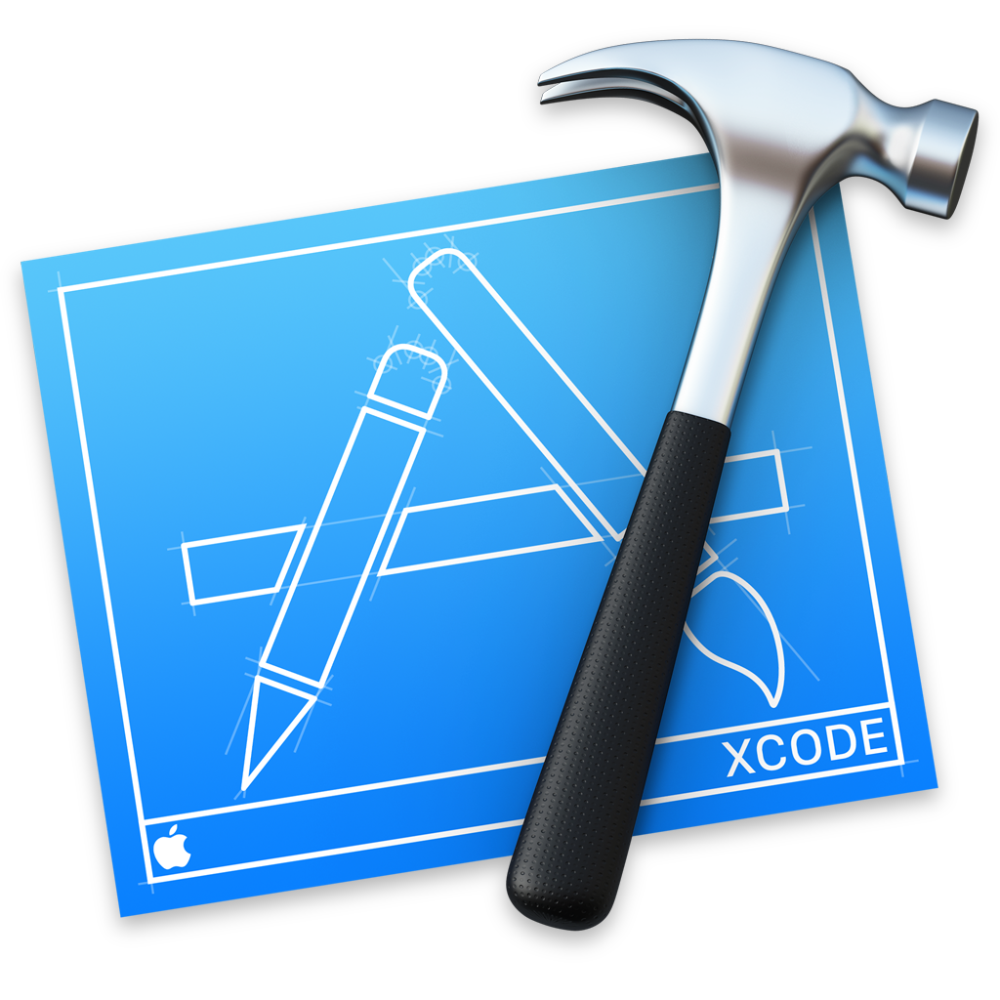

# [](http://makeapullrequest.com)

### App Screenshots


### App Walkthrough


### Installation to run Locally

* Download & Install [XCODE](https://developer.apple.com/xcode/)
* Download & Install [Cocoapods](https://guides.cocoapods.org/using/getting-started.html)


```
$ git clone repository
$ cd into project folder pHOODz
madke sure Xcode is closed
$ pod install
open .workspace Xcode file
Run build, in Xcode
```
### Run App Locally on your machine in Xcode

```
with XcodeProject.workspace file open,
plug in your iOS device.
Select your phone from the device drop down menu.
Set up "Signing" under the "general" tab.
Run build; side loads the app onto your device.
```
### Overview
* I wanted to make this app as user friendly as possible. To do that, I wrote as much "behind the screen" as I could. Thanks to Apple's core functionality kits, and Firebase's DB capabilities, user interaction is minimal.
* When the user opens the app, Location Services begin determining your current location. This eliminates the need for the user to waste time entering their current zip code.
* On the home screen, the user can pick from a list of search queries that they have previously saved. This extends to functionality of the app to apply to virtually any common search parameter. Press the "plus" button to add a new search, or click on any from the list.
* After a search button is pressed, for this example I searched for "Places to Eat", the app brings you to the stack of cards. Each card is a result from the search, with the closest results showing first.
* If you do not want to patron the current result, simply Swipe the card Left. If the particular search result suits your fancy, then Swipe the card Right!
* If swiping cards has tired you out, click on the "Search" navigation button on the bottom right to bring up a traditional list view. This view is also useful if the user wants to search within the results found.
* Once a card is Swiped Right, or a list item is selected from the table view, the app is directed to a full screen Map, ready to navigate the user to their requested destination.

## Built With

*  - Xcode 9
*  - Xcode 9
*  - Xcode 9
*  - Xcode 9


## Built by:

* **Weston Gibler** [Portfolio](https://westongibler.com)

## License

This project is licensed under the MIT License
